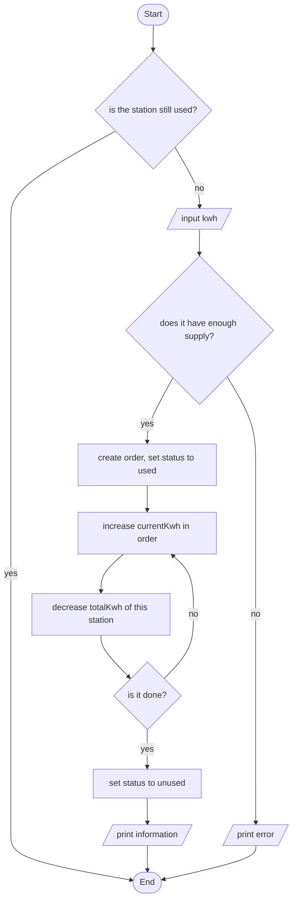
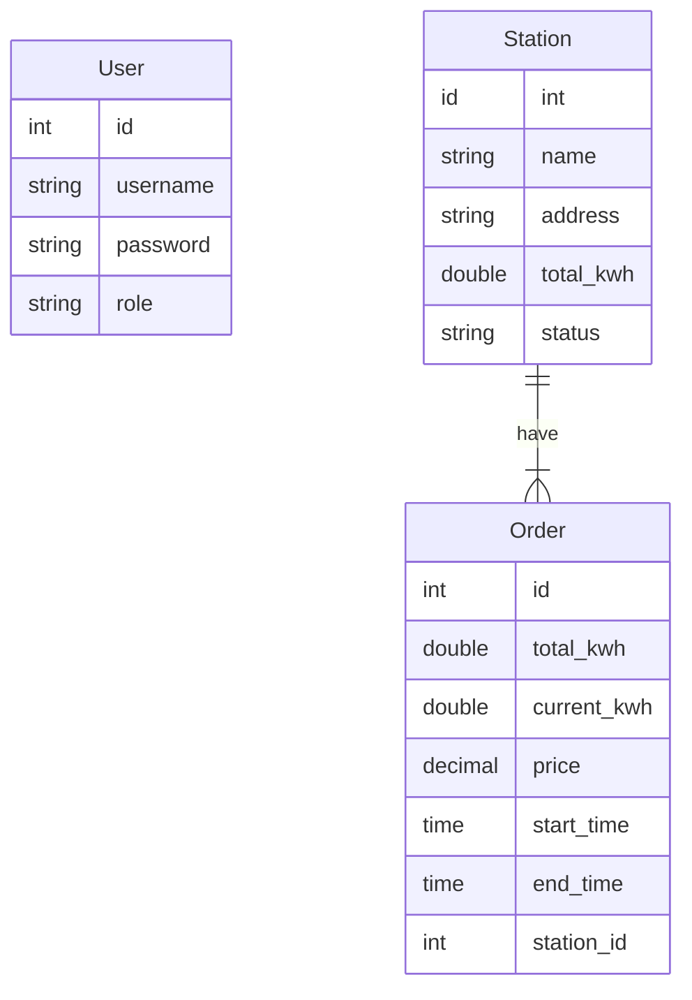

# Flowchart

```mermaid
flowchart TB
    start([Start]) -->  used_check{is the station still used?}-- no --> input[/input kwh/]
    input --> kwh_check
    used_check --yes--> stop
    kwh_check{does it have enough supply?}
    kwh_check -- yes --> kwh_check_yes[create order, set status to used]
    kwh_check_yes --> update_progress[increase currentKwh in order] --> decrease_kwh[decrease totalKwh of this station] --> is_done{is it done?}
    is_done -- yes --> unused[set status to unused] --> print_info[/print information/]-->stop
    is_done -- no --> update_progress
    kwh_check -- no --> print_error[/print error/]
    print_error--> stop([End])
```

# ERD

```mermaid
erDiagram

User {
    int id
    string username
    string password
    string role
}

Station {
    id int
    string name
    string address
    double total_kwh
    string status
}

Order {
    int id
    double total_kwh
    double current_kwh
    decimal price
    time start_time
    time end_time
    int station_id
}

Station || -- |{ Order : have
```