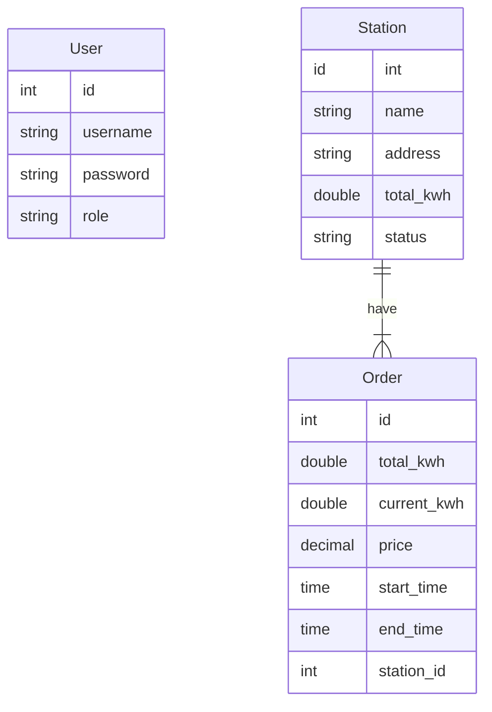

```mermaid
erDiagram

User {
    int id
    string username
    string password
    string role
}

Station {
    id int
    string name
    string address
    double total_kwh
    string status
}

Order {
    int id
    double total_kwh
    double current_kwh
    decimal price
    time start_time
    time end_time
    int station_id
}

Station || -- |{ Order : have
```